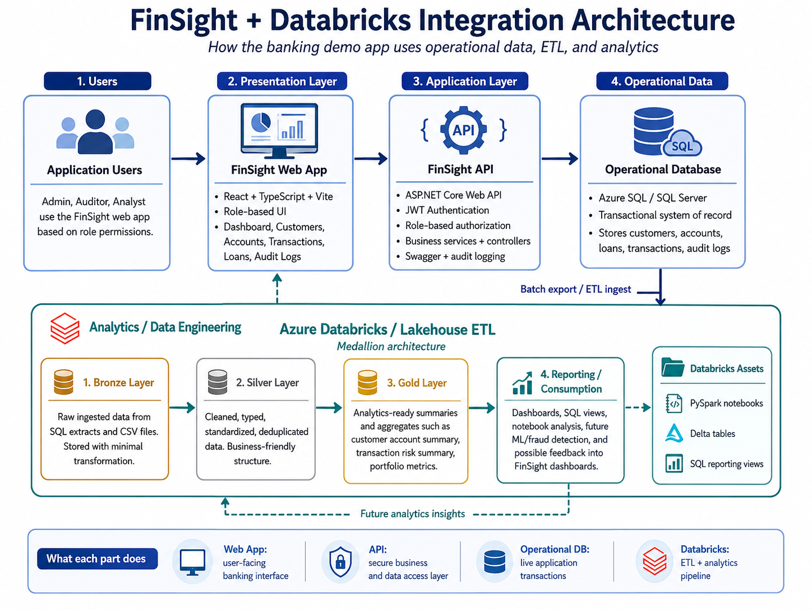

# FinSight

FinSight is a full-stack banking and financial analytics demo application built with ASP.NET Core, SQL Server, React, TypeScript, JWT authentication, Azure hosting, and a Databricks-style Bronze/Silver/Gold analytics pipeline.



The project demonstrates enterprise software engineering, API development, secure frontend integration, database-backed financial workflows, cloud deployment, and data engineering architecture.

---

## Live Azure Deployment

### Frontend

```text
https://mango-stone-09a94e910.7.azurestaticapps.net
```

Hosted with Azure Static Web Apps.

### API

```text
https://finsight-api-cw-2026-gxfuekapcygsdsav.centralus-01.azurewebsites.net
```

Hosted with Azure App Service.

Health check:

```text
GET /health
```

### Database

Hosted with Azure SQL Database.

Database:

```text
FinSightDb
```

---

## Tech Stack

### Backend

- ASP.NET Core Web API
- C#
- .NET 8
- Entity Framework Core
- SQL Server / Azure SQL Database
- JWT authentication
- Role-based authorization
- FluentValidation
- Repository and service-layer architecture
- Audit logging
- Swagger/OpenAPI
- Azure App Service hosting
- Azure SQL retry resiliency with `EnableRetryOnFailure`

### Frontend

- React
- TypeScript
- Vite
- Axios
- React Router
- Protected routes
- Auth context
- JWT token storage
- Dark enterprise-style UI
- Azure Static Web Apps hosting
- GitHub Actions deployment workflow

### Data Engineering

- Azure Databricks-style pipeline
- PySpark notebooks
- Delta table design
- Bronze, Silver, and Gold lakehouse layers
- SQL reporting views
- Sample financial transaction data

---

## Current Features

### Authentication

- User login through the FinSight API
- JWT token storage in localStorage
- Protected frontend routes
- Logout functionality
- Navbar updates based on authentication state
- Demo users accounts (Admin,Analyst,Auditor)

## Demo Users

The deployed demo includes three seeded application users. Each role has different access inside the FinSight web app.

```text
Admin
Username: admin
Password: Password123!
Access: Full access to Dashboard, Customers, Accounts, Transactions, Loans, Audit Logs, and loan approve/reject actions.

Auditor
Username: auditor
Password: Password123!
Access: Dashboard, Customers, Accounts, Loans in read-only mode, and Audit Logs. No Transactions tab and no approve/reject actions.

Analyst
Username: analyst
Password: Password123!
Access: Accounts and Transactions only. No Dashboard, Customers, Loans, or Audit Logs.

### Customers

- Loads customer profiles from the API
- Displays customer number, name, email, risk rating, and created date
- Uses paged API result handling

### Accounts

- Loads account records from the API
- Displays account number, customer, account type, available balance, and status
- Handles API balance mapping through `availableBalance`

### Transactions

- Loads transactions by selected account
- Uses the account-scoped endpoint:

```text
GET /api/Accounts/{accountId}/transactions
```

- Displays date, account, transaction type, amount, and description

### Loan Applications

- Loads loan applications from the API
- Displays customer, amount, loan type/purpose, status, and submitted date
- Supports approve and reject actions through API endpoints
- Handles loan type mapping through `loanType` / `LoanType`

### Dashboard

- Displays live API-backed summary counts:
  - Customers
  - Accounts
  - Loan applications
  - Open loan decisions
- Includes portfolio status, known issues, and Databricks roadmap sections

---

## Azure Deployment Architecture

```text
React frontend   -> Azure Static Web Apps
ASP.NET Core API -> Azure App Service
Database         -> Azure SQL Database
Analytics        -> Databricks-style pipeline files in repo
CI/CD            -> GitHub Actions
```

### Azure App Service Configuration

The API uses Azure App Service environment variables for production settings.

Important settings:

```text
ASPNETCORE_ENVIRONMENT=Production
Jwt__Key=<production JWT signing key>
Jwt__Issuer=FinSight.Api
Jwt__Audience=FinSight.Client
SeedDemoData=true
Cors__AllowedOrigins__0=http://localhost:5173
Cors__AllowedOrigins__1=https://mango-stone-09a94e910.7.azurestaticapps.net
ConnectionStrings__DefaultConnection=<Azure SQL connection string>
```

Secrets and production connection strings are not committed to source control.

### Azure Static Web Apps Configuration

The frontend build uses:

```text
VITE_API_BASE_URL=https://finsight-api-cw-2026-gxfuekapcygsdsav.centralus-01.azurewebsites.net
```

The Static Web App uses React Router fallback routing through:

```text
FinSight.Web/public/staticwebapp.config.json
```

---

## Databricks Pipeline

The `Databricks` folder contains a lakehouse-style analytics pipeline.

```text
Databricks/
  notebooks/
    01_bronze_transactions_ingest.py
    02_silver_transactions_clean.py
    03_gold_customer_account_summary.py
  sql/
    create_gold_views.sql
  sample-data/
    transactions_sample.csv
  docs/
  README.md
```

### Bronze Layer

Raw transaction data is ingested with minimal transformation.

Output table:

```text
finsight_bronze.transactions_raw
```

### Silver Layer

Transactions are cleaned, typed, standardized, and classified as inflow or outflow records.

Output table:

```text
finsight_silver.transactions_clean
```

### Gold Layer

Customer/account-level transaction summaries are created for reporting.

Output table:

```text
finsight_gold.customer_account_summary
```

### Reporting Views

Defined in:

```text
Databricks/sql/create_gold_views.sql
```

Views include:

```text
finsight_reporting.vw_customer_account_summary
finsight_reporting.vw_transaction_volume_by_type
finsight_reporting.vw_high_value_transactions
```

---

## API Areas

The API includes endpoints for:

```text
Auth
Customers
Accounts
Account transactions
Deposits
Withdrawals
Transfers
Loan applications
Loan approval/rejection
Audit logs
Health checks
```

Example auth endpoint:

```text
POST /api/Auth/login
```

Example customer endpoint:

```text
GET /api/Customers
```

Example account transactions endpoint:

```text
GET /api/Accounts/{accountId}/transactions
```

Example loan workflow endpoints:

```text
GET  /api/LoanApplications
POST /api/LoanApplications/{id}/approve
POST /api/LoanApplications/{id}/reject
```

Health endpoint:

```text
GET /health
```

---

## Frontend Project Structure

```text
FinSight.Web/
  src/
    app/
    components/
    config/
    features/
      auth/
      customers/
      accounts/
      transactions/
      loans/
      dashboard/
    lib/
    styles/
```

The frontend uses a feature-based structure so each business area owns its own API calls, types, and page components.

---

## GitHub Workflow Highlights

This project includes portfolio-style branch and PR work for:

- Customer page
- Accounts page
- Transactions page
- Loan applications page
- Dashboard summary
- Auth state and protected routes
- UI polish
- Databricks pipeline
- Azure hosting configuration
- .NET 8 upgrade
- Azure SQL retry resiliency
- Bug fixes linked to GitHub issues

Examples of fixed bugs:

```text
Account balance display issue
Loan purpose / LoanType display issue
Azure SQL connection string issue
Azure SQL missing schema issue
Static Web Apps workflow mismatch
```

---

## Local Development

### Run the API

From the repo root:

```cmd
dotnet run --project FinSight.Api
```

Local API:

```text
https://localhost:7029
```

Swagger locally:

```text
https://localhost:7029/swagger
```

Health check locally:

```text
https://localhost:7029/health
```

### Run the React frontend

From the frontend folder:

```cmd
cd FinSight.Web
npm install
npm run dev
```

React local URL:

```text
http://localhost:5173
```

Local frontend environment file:

```text
FinSight.Web/.env.local
```

Local value:

```text
VITE_API_BASE_URL=https://localhost:7029
```

---

## Database Setup

Local development uses SQL Server / LocalDB.

Azure deployment uses Azure SQL Database.

Apply migrations with:

```cmd
dotnet ef database update --project FinSight.Data --startup-project FinSight.Api
```

For Azure SQL, use the Azure SQL connection string through a secure local command or Azure App Service configuration. Do not commit passwords or production connection strings.

---

## Deployment Notes

### API Deployment

The API is published to Azure App Service.

Important production configuration is managed in Azure App Service environment variables.

### Frontend Deployment

The frontend is deployed to Azure Static Web Apps through GitHub Actions.

Important workflow settings:

```yaml
app_location: "FinSight.Web"
api_location: ""
output_location: "dist"
app_build_command: "npm run build"
```

### CORS

The API must allow both local React development and the deployed Static Web App.

```text
http://localhost:5173
https://mango-stone-09a94e910.7.azurestaticapps.net
```

---

## Security Notes

- JWT secrets are stored in Azure App Service settings.
- SQL connection strings are stored in Azure App Service settings.
- Production secrets should never be committed.
- SQL passwords should be rotated if exposed during troubleshooting.
- Swagger is primarily intended for local development/demo testing.

---

## Project Goals

FinSight is intended to demonstrate:

- Enterprise API design
- Full-stack React and ASP.NET Core development
- Secure JWT authentication
- SQL Server-backed business workflows
- Azure App Service deployment
- Azure Static Web Apps deployment
- Azure SQL Database integration
- Clean frontend feature architecture
- Audit logging and role-based authorization
- Financial transaction workflows
- Databricks-style analytics pipeline design
- Portfolio-ready software and data engineering capability

---

## Future Enhancements

- Add customer creation form
- Add account creation workflow
- Add deposit, withdrawal, and transfer UI actions
- Add richer dashboard charts
- Add Power BI or Databricks SQL dashboard integration
- Connect Databricks notebooks to Azure Data Lake Storage
- Add Azure Key Vault for secrets
- Add Application Insights logging
- Add automated database migration strategy for deployment
- Add integration tests for deployed API workflows
